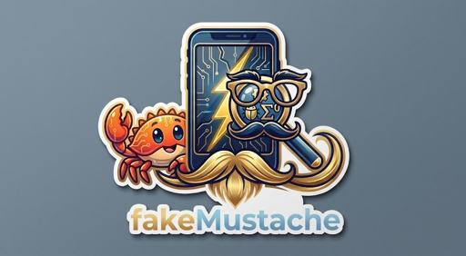
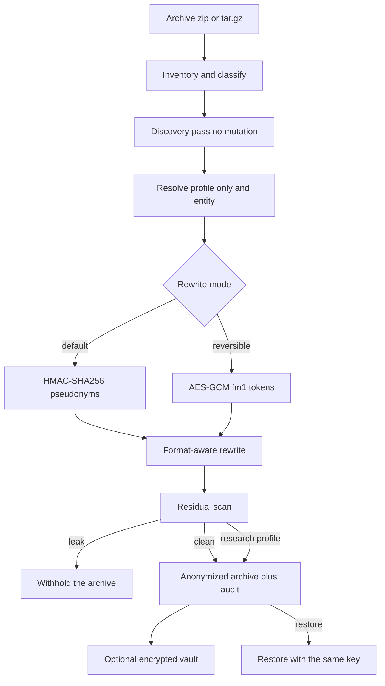

# fakeMustache

<p align="center">
  
</p>

**This tool makes a diagnostic archive safer to share with someone who does not already know you. It does not make you anonymous to someone who is already investigating you.**

Diagnostic archives (Android bugreports, Apple sysdiagnoses) carry a behavioural fingerprint: which apps are installed, when they were installed, crash patterns, usage rhythm. An adversary who suspects a particular person can usually confirm it even after every email, phone number, and GPS coordinate is gone. Defeating that would mean destroying the evidence the archive exists to carry. fakeMustache removes identifiers; it does not claim to defeat confirmation attacks. See `SPEC.md` §16.2.

---

fakeMustache anonymizes Android bugreports and Apple sysdiagnose archives so they can be shared **without destroying their forensic value**. It is a **pseudonymization** tool, not a redaction tool: the same email becomes the same `user-<hex>@example.invalid` everywhere, so equality, joins, and cardinality survive for detection pipelines.

## How a run works



Inventory decides what is kept. Images, Safari history, knowledgeC, and log archives are dropped before anything is rewritten. Discovery records identifiers; it does not change bytes. The profile, `--only`, and `--entity` then pick an action per kind. The default rewrite is a one-way pseudonym. `--reversible` writes an `fm1.` token in place of each private value so the same key can put the original back. A residual hit that is not a known pseudonym, and whose kind was not kept, withholds the output — except the research profile, which warns and continues. The audit files never contain original values.

## Quick start

```bash
cargo build -p fm-cli --release
./target/release/fakemustache -i bugreport.zip -o bugreport-anon.zip
./target/release/fakemustache --explain -i bugreport.zip
```

Reports are written beside the output as `fakemustache-report.json` and `.md` (never containing original values).

## Profiles

| Profile | Use |
|---------|-----|
| `balanced` (default) | Sharing with a researcher / support channel |
| `strict` | Public corpus / untrusted recipient |
| `research` | Trusted collaborator — **prints a warning**; not safe for public release |

## Choosing what to anonymize

The profile sets a default action for every information type. Override it precisely:

```bash
fakemustache --list-entities
fakemustache -i bugreport.zip -o out.zip --only email,imei,ssid
fakemustache -i bugreport.zip -o out.zip --only identifiers
fakemustache -i bugreport.zip -o out.zip --entity gps=keep --entity imei=drop
fakemustache --explain -i bugreport.zip --only network --entity ssid=keep
```

`--only` keeps every kind you did not name. `--entity KIND=ACTION` wins over both `--only` and the profile. Actions are `keep`, `pseudo`, `drop`, `generalize`, `shift`.

Groups: `identifiers`, `accounts`, `device`, `network`, `location`, `all`.

## Reversible mode

By default, replacements are one-way pseudonyms. `--reversible` instead writes an encrypted token **in place of** each private value. The same key puts the original text back. Do not send the key with the archive.

```bash
fakemustache -i bugreport.zip -o shared.zip --reversible --key-file ./owner.key
fakemustache -i shared.zip -o original.zip --restore --key-file ./owner.key
```

A passphrase works the same way (`--passphrase`). Without the key the tokens cannot be opened. With the key, rollback is exact for the values that were encrypted.

## Design contract

Running `bugreport-extractor-library` / `sysdiagnose-extractor-library` plus Sigma rules over the original and the anonymized archive must yield identical results after applying the pseudonym mapping (modulo declared divergences such as dropped GPS coordinates). `SIGMA_FIELDS.md` in the bugreport extractor is the authoritative preservation list.

## WASM

`fm-wasm` exposes `anonymize(input, opts)` for in-browser use so the raw archive never leaves the device. Integrate from `ismyphonepwned.github.io` by loading the wasm bundle and streaming per-member (see `crates/fm-wasm`).

## Spec

Full technical specification: [`SPEC.md`](SPEC.md) (branded rename of the mobilediag2anon design).

## License

Apache-2.0 — see `LICENSE`.
